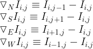
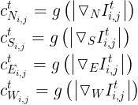

# AnisotropicDiffusion-Image :rocket:
In image processing and computer vision, anisotropic diffusion, also called Perona–Malik diffusion, is a technique aiming at reducing image noise without removing significant parts of the image content, typically edges, lines or other details that are important for the interpretation of the image. Anisotropic diffusion resembles the process that creates a scale space, where an image generates a parameterized family of successively more and more blurred images based on a diffusion process. Each of the resulting images in this family are given as a convolution between the image and a 2D isotropic Gaussian filter, where the width of the filter increases with the parameter. This diffusion process is a linear and space-invariant transformation of the original image. Anisotropic diffusion is a generalization of this diffusion process: it produces a family of parameterized images, but each resulting image is a combination between the original image and a filter that depends on the local content of the original image. As a consequence, anisotropic diffusion is a non-linear and space-variant transformation of the original image.

Although the resulting family of images can be described as a combination between the original image and space-variant filters, the locally adapted filter and its combination with the image do not have to be realized in practice. Anisotropic diffusion is normally implemented by means of an approximation of the generalized diffusion equation: each new image in the family is computed by applying this equation to the previous image. Consequently, anisotropic diffusion is an iterative process where a relatively simple set of computation are used to compute each successive image in the family and this process is continued until a sufficient degree of smoothing is obtained.

https://en.wikipedia.org/wiki/Anisotropic_diffusion

## Definition
Let    denote a subset of the plane and    be a family of gray scale images. Then anisotropic diffusion is defined as:

t represents each iteration, being I(.,0) the input image.

c, the diffusion coefficient, controls the rate of diffusion and is usually chosen as a function of the image gradient so as to preserve edges in the image.

### Final formula
In practise, we work with the final formula which is the following:

Where  

If you want to know where it comes from, check it out in the original paper: https://ieeexplore.ieee.org/document/56205

The function used for the diffusion coefficient:

the constant K controls the sensitivity to edges and is usually chosen experimentally or as a function of the noise in the image.

<table style="padding:10px">
  <tr>
    <td></td>
    <td></td>
  </tr>
</table>
